  

 

## 🔬 Academic & Institutional Credentials

<table>
<tr>
<td width="50%" valign="top">

**IJAIKE Readers Committee**
Editorial Reviewer for the *International Journal of Artificial Intelligence and Knowledge Engineering*, governed by NASA & Siemens veterans.

**Institutional Validation**
World Bank UNMAPPED Challenge (Informal Economy Verification) · Singapore AI Hackathon (National Scam Defense)

</td>
<td width="50%" valign="top">

**Scientific Registries**

| Registry | ID |
|:--|:--|
| 🔗 ORCID | [`0009-0006-4724-4303`](https://orcid.org/0009-0006-4724-4303) |
| 🔗 Web of Science ResearcherID | `QSO-1958-2026` |
| 🔗 arXiv | `muavia12_` |
| 🔗 ScholarOne | ManuscriptCentral (`muaviakha83@gmail.com`) |

</td>
</tr>
</table>

 

## ⚡ Featured Systems Architecture — The NeuroSyn Suite

<table>
<tr>
<td width="15%" align="center"><h3>🚀</h3><b>NeuroSyn-Dev</b> Autonomous Engineering OS</td>
<td width="85%">
<b>AMD ROCm + Cloud Hybrid Split.</b> Features AST parsing, Directed Acyclic Graph (DAG) task planning, and local <code>Qwen2.5-Coder</code> (AMD GPU) + <code>Gemma-27B</code> (Fireworks Cloud) routing. Executes code in isolated Docker containers with runtime self-healing.
  

</td>
</tr>
<tr>
<td width="15%" align="center"><h3>🛸</h3><b>NeuroSyn-Aero</b> Aerospace Diagnostics & PHM</td>
<td width="85%">
<b>Physics-Grounded AI.</b> Eliminates numerical hallucinations by combining 5D Discrete Kalman Filters (DKF) and Bayesian Competing Hypotheses (BCH) over 20kHz NASA IMS sensor streams with a parallelized multi-agent specialist debate layer.
  

</td>
</tr>
<tr>
<td width="15%" align="center"><h3>🤖</h3><b>NeuroSyn-Copilot</b> Autonomous AI Workforce</td>
<td width="85%">
<b>100% Local Inference.</b> CLI-deployed (<code>npx neurosyn-copilot-os</code>) multi-agent workforce (Node.js/Ollama) that parses spreadsheets/PDFs into editable vector slide decks (PPTX), Word briefs, and PDF reports rated by a custom <b>NeuroScore™</b>.
  

</td>
</tr>
<tr>
<td width="15%" align="center"><h3>💼</h3><b>SAP-Synapse Engine</b> Enterprise ERP Forensics</td>
<td width="85%">
<b>Day-Zero Audit Engine.</b> Connects to SAP RFC/BAPI interfaces, executing sandboxed Python statistical joins (<code>pandas</code>/<code>numpy</code>) and multi-agent compliance audits to collapse audit cycles from 10 days to &lt;24 hours.
  

</td>
</tr>
</table>

 

## 🛠️ Technical Stack & Frameworks

<table>
<tr><td width="30%"><b>AI / LLM Orchestration</b></td><td>vLLM · Ollama · DeepSeek-R1 · Qwen2.5-Coder · Gemma-2 · LangGraph · AutoGen · Custom DAG Routers</td></tr>
<tr><td><b>Hardware & Acceleration</b></td><td>AMD ROCm · PyTorch · Docker Sandboxing (Container Isolation) · Memory-Capped Runtimes</td></tr>
<tr><td><b>Deterministic & Mathematical Substrates</b></td><td>Discrete Kalman Filters (DKF) · Bayesian Inference · AST Static Analysis · Jaccard Adjacency Graph Matching</td></tr>
<tr><td><b>Full-Stack & Backend Systems</b></td><td>Python 3.11+ · Node.js (Express/Socket.io) · React.js · TailwindCSS · C++ · REST APIs</td></tr>
<tr><td><b>Databases & Storage</b></td><td>MongoDB Atlas · Neo4j Knowledge Graphs · Redis Caching</td></tr>
</table>

 

## 📊 Live Activity

 

 

## 🐍 Contribution Snake

Animated snake auto-generated nightly from contribution graph — set up via <a href="https://github.com/Platane/snk">Platane/snk</a> GitHub Action on your profile repo.

 

## 🌐 Live Portals & Platforms

| Platform | Link |
|:--|:--|
| 🌐 Platform Showcase | [neurosyn.onrender.com](https://neurosyn.onrender.com/) |
| 📄 Journal Affiliation | [International Journal of AI & Knowledge Engineering (IJAIKE)](https://ijaike.org/) |
| 🏢 Commercial Entity | AAKS / Eurasia Academic Publishing Group Limited |

 

### 📫 Open for research partnerships, architectural consulting, and high-compliance enterprise AI implementations

**[Email](mailto:muaviakha83@gmail.com)** · **[LinkedIn](https://www.linkedin.com/in/muavia-tanveer-9a6856328/)** · **[ORCID](https://orcid.org/0009-0006-4724-4303)**

 

